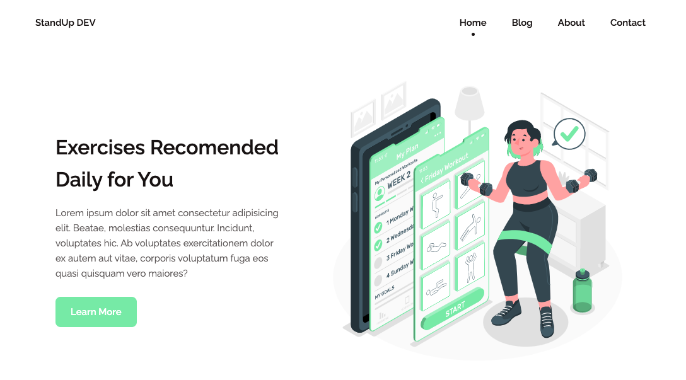
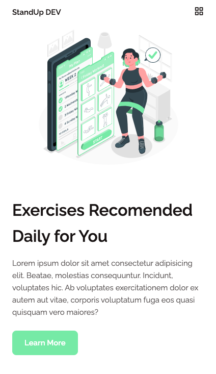
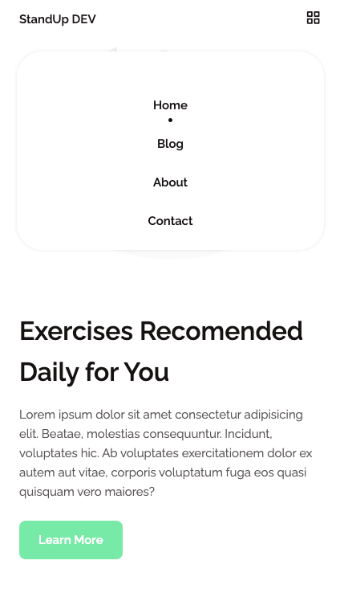

# StandUpDev

This project was based on the following article and project written and created by Israel Mitolu:
[How to Get Started with SASS](https://freecodecamp.org/blog/getting-started-with-sass)

# Features of Sass learned

- Variables;
- Nesting;
- Parent Selector;
- Partials;
- Mixins;
- Functions and Operators;
- Compile Sass using VSCode extension.

# Final Layout Design - Screenshots

Desktop Layout



Mobile layout



Menu on Mobile Layout



# To compile the scss files into a css file

- Instaled a `Live Sass Compile` Extension on VSCode;
- Configured it in `settings.json` just like explained by Mitolu in his article:

```
"liveSassCompile.settings.formats":[
    {
      "format": "expanded",
      "extensionName":".css",
      "savePath":"/styles",
    }

```

- Clicked on the button "Watch Sass" at the very bottom of the VSCode window.
